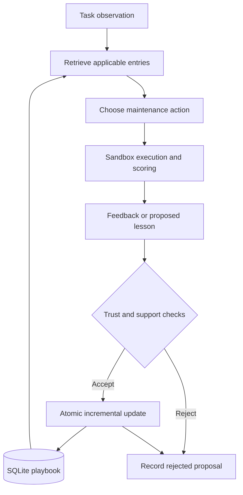
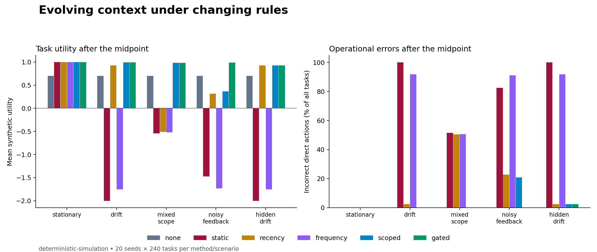

# Agentic Context Engineering under Policy Drift: Validity-Gated Playbooks for Operational Agents

**Research manuscript and reproducible systems pilot**  
**Prepared for:** Arup Chakraborty — author review required  
**Version:** 0.2, 16 September 2026 — writing revision; experiments unchanged  
**Companion project:** `ace-context-lab`  
**Status:** Research draft with completed simulation experiments. Testing with real language models is still pending.

> Attribution: *Agentic Context Engineering: Evolving Contexts for Self-Improving Language Models* is the title of an existing paper by Qizheng Zhang and colleagues [1]. This manuscript studies a narrower operational question inspired by that work. It does not claim to introduce ACE, reproduce its results, or establish a new state of the art.

## Abstract

An agent may remember the right solution from a previous task and still take the wrong action today. The software version may have changed, the task may be running in a different region, or the feedback used to update memory may be incorrect. In this paper, we study how an agent can check whether a previous lesson still applies before using it. We build a small framework that separates task execution, feedback and memory updates, and compare six memory policies across five operational scenarios. The pilot contains 144,000 simulated decisions, using 20 seeds and 240 tasks per stream. With clean feedback and visible policy changes, simple version filtering performs the same as a method that also checks feedback trust. When incorrect feedback is explicitly marked untrusted, the trust check reduces post-change incorrect actions from 20.83% to zero compared with scope filtering alone, with a paired utility gain of 0.623. Both methods still make initial mistakes when the policy changes without a version update. These results show how the memory controls behave in a programmed simulation. They do not yet establish improvement in a real language model. We provide the Python project, SQLite records, complete experiment traces and an optional local-model adapter so the next stage can test that claim.

**Keywords:** context engineering; agent memory; policy drift; continual adaptation; provenance; operational agents; reproducibility.

## 1. Introduction

Consider a cloud maintenance agent that learns to restart auxiliary workers in parallel. This works for the current release. In the next release, a new dependency requires the workers to start one at a time. The task still refers to the same service and asks for the same outcome. If the agent reuses the old procedure, its memory is now leading it to the wrong action.

Memory can save repeated work. An agent should not need to investigate the same procedure from the beginning every time. But before it reuses that procedure, it needs to check whether the conditions are still the same. For this case, the important question is: how does the agent know that what worked before will work for the current task?

We use **context adaptation** to describe changes to the information supplied to a fixed model or decision policy. In this paper, **model learning** refers specifically to changes in model parameters. **System improvement** means a measured improvement in the combined model, retrieval and execution process. Keeping these terms separate helps us state what the experiment actually demonstrates.

We focus on rules that have a service, region and policy version. This keeps the first experiment small enough to inspect every decision and memory update. Scope filtering is an established engineering practice. Our contribution is a reproducible way to test when it helps an evolving playbook and when it is insufficient.

The paper provides a design for checking memory applicability, an experiment that separates visible changes from hidden changes and incorrect feedback, and results showing which controls account for the improvement.

### 1.1 What we want to test

Our main hypothesis is that an agent can reuse experience more reliably when it checks whether that experience still applies to the current task.

We need to establish three things:

- Reusing valid lessons reduces repeated investigation without increasing mistakes.
- Checking the version, region and service reduces mistakes caused by outdated lessons.
- Checking feedback before saving it prevents known-untrusted guidance from influencing later tasks.

The current pilot tests these mechanisms in a simulation. The next stage must test whether they also reduce mistakes and total task cost for real LLM agents.

## 2. Research context and evidence boundaries

### 2.1 The original ACE contribution

ACE maintains context as an evolving playbook. Its Generator, Reflector and Curator handle execution, lesson extraction and update construction. It uses structured deltas and deterministic merging to reduce information loss from rewriting the entire context. Entry identifiers and helpful/harmful counters support local updates. Its evaluations include AppWorld and finance tasks. [1]

Table 1 of the March 2026 paper reports an AppWorld average across four completion metrics of 42.4 for base ReAct, 46.4 for offline GEPA and 59.4 for offline ACE with labels. The ACE–GEPA difference is 13.0 points for that configuration. We have not reproduced those results. [1]

That version also evaluates weaker and noisy reflection. Our question is narrower: whether stored operational guidance still applies after the rules change. [1]

### 2.2 Related mechanisms

| Research line | Established mechanism | Relevance to this study |
|---|---|---|
| Reflexion | Stores linguistic feedback in episodic memory for later attempts. [2] | Motivates distinguishing feedback generation from evidence of correctness. |
| Dynamic Cheatsheet | Maintains reusable strategies and code snippets across queries without updating model weights. [3] | Makes persistent context a meaningful baseline, beyond isolated prompting. |
| GEPA | Reflects on execution traces and searches candidate prompts using a genetic Pareto approach. [4] | A future comparator for optimizing instructions rather than rule applicability. |
| A-MEM | Organizes interconnected memory notes with contextual attributes and dynamic links. [5] | Provides an alternative to a flat rule store; organization alone does not test temporal validity. |
| MemRL | Uses environment feedback to learn memory utility with two-phase retrieval. [6] | Suggests comparing retrieval utility with semantic similarity and recency. |
| EvolveMem | Adjusts retrieval configuration through a diagnosis loop with regression safeguards. [7] | Shows that stored knowledge and retrieval policies are distinct adaptation targets. |

Liu and colleagues show that a model's performance can depend on where relevant information appears in a long context. This gives us a reason to evaluate which information we retrieve and where we place it. Their results do not tell us the size of that effect for later models. [8]

Incorrect guidance can also enter through memory updates. MINJA demonstrates memory injection through query-only interaction. Our experiment covers a simpler case: the simulator already marks the incorrect proposals as untrusted. We therefore cannot use this pilot to claim a defense against MINJA. [9]

AppWorld evaluates interactive coding agents through programmatic checks of the resulting state, including unintended changes. It is a useful option for a later experiment with more realistic tasks than choosing between two maintenance actions. [10]

### 2.3 Literature review method

We reviewed primary research and official implementation documentation available on 15 September 2026. We started with the ACE paper, then examined persistent memory, reflective prompt optimization, adaptive retrieval, long-context use and memory injection. References [1]–[10] are research papers, and [11]–[12] cover implementations. This is a focused narrative review; it does not provide exhaustive database coverage or a PRISMA screening process.

We examined the ACE methods, benchmark tables, ablations and cost discussion. We used the related papers to understand their mechanisms and research scope. We did not combine their performance scores because they use different models, datasets, feedback and cost measures. The references identify the recent preprints as such; an arXiv record or code repository alone does not establish peer review.

## 3. Problem formulation

For each task \(t\), the agent receives an observation \(x_t\), retrieves context \(C_t\) from memory \(M_t\), and chooses an action \(a_t\). The environment then returns feedback \(f_t\). We score the action before allowing that feedback to update memory:

\[
C_t=R(M_t,x_t),\qquad a_t=G(x_t,C_t),\qquad
M_{t+1}=U(M_t,x_t,a_t,f_t).
\]

The evaluator knows the required action \(a_t^*\). The generator does not. It receives only the service, region, advertised policy version and task index. The required rule stays in a separate evaluator table that the generator cannot inspect.

Each memory entry stores an identifier, service, region, version, action, support count, last-observed step and source label. An entry applies when its service, region and version match the current task:

\[
A(m,x_t)=\mathbf{1}[m.service=x_t.service]\,
\mathbf{1}[m.region=x_t.region]\,
\mathbf{1}[m.version=x_t.version].
\]

This check compares metadata. It cannot tell us whether the version label is correct, whether the policy was deployed properly, or whether the remembered action caused the previous success. We need separate evidence for those questions.

The gated policy accepts an update only when the feedback is marked trusted and comes from the simulator verifier. In the optional model path, the reflector's proposed action must also agree with the received feedback. The task record supplies the scope; the model cannot assign its own scope or trust status.

### 3.1 Research questions

**RQ1 — Adaptation:** How much does updating a playbook help after an observable policy change, compared with freezing it?

**RQ2 — Attribution:** Does a gated update mechanism add value beyond service/region/version filtering when feedback is clean?

**RQ3 — Feedback quality:** What changes when some memory proposals are incorrect but explicitly marked untrusted?

**RQ4 — Observability:** What happens when policy changes are not reflected in available metadata?

**RQ5 — Economics:** Is an improvement due to fewer incorrect actions, fewer inspections, or both?

We expected recent lessons to help after visible changes, scope checks to help when regions use different rules, and trust checks to help when incorrect proposals are marked untrusted. We specified these expectations while developing the project, but did not independently preregister the pilot. RQ2 is particularly important: if a simple filter achieves the same result, we should report that.

## 4. System design

### 4.1 Cold start and inspection

When the agent has no matching memory, it chooses `inspect`. The simulator checks the current rule, completes the task correctly and charges a fixed lookup cost. This gives the agent a way to handle cold start and lets us compare memory reuse with checking the rule on every task.

We assume that inspection always succeeds. In a real system, it may fail, return conflicting information or take more time than expected. An agent that inspects every task therefore has perfect completion in this simulator. We also measure the number of inspections so that perfect completion does not hide repeated work.

### 4.2 Incremental persistence

We use SQLite for the playbook and the record of accepted and rejected proposals. A uniqueness constraint covers service, region, version and action. When the same proposal appears again, its support count increases without creating a duplicate entry. Updating one rule leaves unrelated entries in place. The count tells us how often a proposal was observed; it does not establish its correctness or causal benefit.

The database can contain conflicting actions. Depending on the method, retrieval selects by recency or frequency. We keep this behavior explicit so it can be inspected. Semantic contradiction analysis, pruning, knowledge graphs, automatic rollback and distributed writers are outside the current implementation.

### 4.3 Optional language-model path

The default project uses programmed action selection and lesson extraction. An external-command adapter allows a language model to perform those steps instead. The included worker connects to a local Ollama model through its documented chat interface and requests structured JSON output. [12]

The generator receives task metadata and retrieved entries. After the action is scored, the reflector receives feedback. Invalid actions or malformed JSON stop the run. The curator controls trust and scope, and the project logs the model outputs and returned usage for review.

We have implemented this adapter, but have not run the pilot with a real model. Its contract tests use mocked responses. We still need to measure reasoning quality, extraction of lessons from text, robustness to natural-language inputs and actual inference cost.

## 5. Experimental method

### 5.1 Dataset construction

Each stream has 240 tasks across three fictional services. The seed controls the starting rules, task order, regional assignments and feedback corruption. The required action is either serial or parallel maintenance. All actions remain inside the simulation.

We run 20 seeds, numbered 0–19, for each of six methods and five scenarios. This gives \(20\times240\times6\times5=144,000\) decisions. Within each seed and scenario, every method receives the same tasks and corruption schedule. Memory starts empty for every trial.

| Scenario | Rule behavior | Observability |
|---|---|---|
| Stationary | No change; one region | Version remains 1 |
| Drift | Every service's rule flips at index 120 | Version changes from 1 to 2 |
| Mixed scope | US/EU rules are opposites; both flip at index 120 | Region and version are visible |
| Noisy feedback | Same visible change plus 20% corrupted feedback proposals | Corrupted proposals are explicitly untrusted |
| Hidden drift | Rules flip at index 120 | Version incorrectly remains 1 |

In the noisy-feedback scenario, corruption changes the action proposed for memory. It does not change the evaluator's decision about whether the task was completed correctly. The rules are deliberately simple and repeat across tasks, so this setup does not test generalization to unseen task families.

### 5.2 Compared policies

We compare the following methods:

- `none`: inspect the current rule for every task.
- `static`: save observations for the first 24 tasks, then freeze memory.
- `recency`: use the latest service-matching entry, without filtering by region or version.
- `frequency`: use the most frequently observed service-matching entry; break ties by recency.
- `scoped`: use the newest entry matching service, region and version.
- `gated`: use the same retrieval as `scoped`, but save only verified proposals.

Each retrieving method can return up to four entries. The deterministic generator uses the first. We also record serialized context bytes because an equal number of entries does not guarantee an equal token count. The pilot does not use a vector index or optimize prompts. The `frequency` method is not an implementation of MemRL, and `recency` is not a full implementation of Dynamic Cheatsheet.

### 5.3 Metrics and statistics

We count a task as completed when the agent takes the correct action directly or completes it through inspection. The incorrect-action rate divides wrong direct actions by all tasks. We report inspections separately as the lookup rate. We calculate a synthetic utility score as follows:

\[
u_t=\begin{cases}
1,&a_t=a_t^*,\\
1-c,&a_t=\text{inspect},\\
-2,&\text{otherwise},
\end{cases}\qquad c=0.3.
\]

The results below cover the 120 tasks after the midpoint, averaged across seeds. We use the same window for the stationary scenario even though its rules do not change. The full-run and pre-change results are available in `per_seed.csv`.

We estimate uncertainty by bootstrapping the 20 seed-level means with 2,000 resamples and a fixed analysis seed. For a paired comparison, we resample the utility difference between gated and the comparator for each seed. This keeps each comparison on matching task streams. The intervals describe variation within this simulator. They do not capture uncertainty about production incidents, other datasets or real model outputs. Some intervals have zero width because the programmed mechanism produces identical counts across seeds.

## 6. Results

### 6.1 Post-midpoint utility

| Scenario | No memory | Static | Recency | Frequency | Scoped | Gated |
|---|---:|---:|---:|---:|---:|---:|
| Stationary | 0.700 | 1.000 | 1.000 | 1.000 | 1.000 | 1.000 |
| Drift | 0.700 | −2.000 | 0.925 | −1.752 | 0.993 | 0.993 |
| Mixed scope | 0.700 | −0.545 | −0.511 | −0.519 | 0.985 | 0.985 |
| Noisy feedback | 0.700 | −1.475 | 0.318 | −1.731 | 0.367 | 0.990 |
| Hidden drift | 0.700 | −2.000 | 0.925 | −1.752 | 0.925 | 0.925 |

*Source: executed `results/pilot/summary.json`. Rounded to three decimals. Synthetic utility; higher is better.*

### 6.2 Errors and lookup burden

| Scenario | Recency errors | Scoped errors | Gated errors | Gated lookups |
|---|---:|---:|---:|---:|
| Stationary | 0.00% | 0.00% | 0.00% | 0.00% |
| Drift | 2.50% | 0.00% | 0.00% | 2.50% |
| Mixed scope | 50.38% | 0.00% | 0.00% | 5.00% |
| Noisy feedback | 22.75% | 20.83% | 0.00% | 3.21% |
| Hidden drift | 2.50% | 2.50% | 2.50% | 0.00% |

*Errors are incorrect direct actions divided by all post-midpoint tasks. The no-memory baseline has zero errors and 100% lookups in every scenario.*

### 6.3 Interpretation

**A visible version change lets the agent check before acting.** The recency method initially uses an outdated rule once for each service, making three errors in 120 tasks. Scoped and gated retrieval find no matching version-2 memory and inspect once per service. Their utility is 0.0675 higher than recency. This advantage comes from the assigned costs of inspection and incorrect actions.

**Simple scope filtering is enough in the clean cases.** Gated and scoped have the same utility in the stationary, drift and mixed-scope scenarios. Adding the trust gate provides no further improvement there. With reliable feedback, matching the service, region and version already explains the observed benefit.

**The trust check helps when incorrect feedback is marked untrusted.** In this case, gated improves utility over scoped by 0.622875. The paired 95% seed-bootstrap interval is [0.576375, 0.668750]. Scoped saves incorrect proposals and later uses them. Gated rejects them and inspects when verified evidence is still missing. The experiment demonstrates the value of rejecting known-untrusted updates; it does not demonstrate that the agent can discover which text is malicious or incorrect.

**A hidden policy change still causes mistakes.** Recency, scoped and gated each make three initial errors when the rule changes but the version label stays the same. The old memory still matches the visible information. Correct feedback repairs it after the mistake. To prevent that first mistake, the agent would need another signal or a fresh inspection.

**Repeated observations can keep an old rule in use.** In the drift scenario, frequency makes incorrect direct actions on 91.75% of post-change tasks. The old rule has accumulated enough observations to outweigh recent feedback. A high support count is therefore insufficient evidence that the rule is still valid.

## 7. Operational implications and cost model

For a maintenance agent, we need to check three things before reusing a lesson: whether it is relevant, whether its evidence is trustworthy, and whether it applies to the current environment. A previous successful run does not settle those questions for every future task. Changes to dependencies, deployment order or API contracts may require the lesson to be checked again.

In an SDLC workflow, a future integration could collect outcomes from task logs, CI and human review. It could propose scoped lessons and test their effect in a shadow workflow before using them on live tasks. For example, a lesson might help determine whether a task needs an architecture review or an additional validation step. The current project does not read Jira, Symphony workpads, repository sessions or CI logs. We would need adapters and non-synthetic evidence to test that integration.

For production use, the memory record should also include source hashes, timestamps, policy effective dates, expiry, links to replacement rules and model/configuration identifiers. We should evaluate memory again when the model changes, because the same context may behave differently with a new model. Old entries can remain in the audit history while being excluded from current retrieval.

To evaluate the cost benefit, let \(C_b\) be the baseline expected cost per task. Let \(C_a\) be the adapted system's serving cost per task, including retrieval, inspection and expected error handling. Let \(C_u\) be the total update cost allocated to \(N\) tasks, including reflection, validation and memory maintenance. The approach pays off when:

\[
N(C_b-C_a)>C_u.
\]

If \(C_b\le C_a\), increasing the task volume does not produce a positive break-even point under this model. Our synthetic utility scores do not estimate dollars. A real evaluation needs generation and reflection tokens, latency, retries, human review effort, cache behavior and failure costs. We need to include the cost of incorrect actions when deciding whether memory is saving work.

## 8. Limitations and threats to validity

**The decision policy is programmed.** It selects the first retrieved action. It does not read a runbook, infer a procedure or solve a new problem. The results establish how these memory policies behave in the simulator.

**Inspection always works, and feedback reveals the rule.** In a real workflow, feedback may be delayed, ambiguous or limited to pass/fail. Here, trusted feedback provides the reusable action after every task. This is supervision through feedback, even though the generator cannot see the answer before acting.

**The simulator supplies the trust flag.** A compromised verifier, a misleading trusted source or forged provenance could defeat the gate. We have not established an adversarial security guarantee.

**Scope checks depend on accurate metadata.** The visible version and region fields make exact matching possible. Hidden drift shows what happens when that information is insufficient. A detector would need another observation, or the agent would need to inspect periodically even when memory appears to match.

**The task space is small.** Three services and two actions make this close to a lookup-table problem. The confidence intervals describe this task generator, not a broad range of operational work. A perfect score within these conditions is not evidence of general competence.

**The baselines isolate specific behaviors.** Recency and frequency deliberately omit some metadata checks. They do not represent the full published algorithms. Beating them does not establish an advantage over official ACE, fresh-document retrieval, a rule engine or an LLM that uses all available metadata.

**We have not measured real serving cost.** Context bytes are not tokens, and the default run has no model latency or API cost. The optional model path also makes unnecessary reflection calls after static memory freezes. That behavior needs to be adjusted before comparing static and adaptive inference costs.

**The model integration still needs an end-to-end run.** The Ollama adapter follows the documented interface and passes contract tests, but no real model or inference server was run for this paper. Its effectiveness remains unknown.

**The pilot has not been independently replicated.** The benchmark and implementation were developed together, without independent preregistration. A stronger effectiveness claim requires independent review, fixed evaluation sets and more varied failure cases.

## 9. Next-stage research protocol

The next experiment needs tasks that require reasoning beyond copying a saved action. We should add natural-language runbooks, versioned API schemas, multi-step plans, checks for side effects and unfamiliar combinations of dependencies.

First, fix the train, validation and test task families. Use validation data to choose retrieval limits, confidence thresholds and inspection frequency. Keep test families separate. Report exact repeats, related new tasks and unseen combinations separately. During online evaluation, score each action before updating memory, and keep memory isolated between methods and streams.

Next, compare fresh inspection without memory, current-document retrieval, recent episodes, exact scope filtering, the official ACE implementation and a gate added to otherwise identical retrieval. Keep the models, tools, feedback and inference budgets matched. Include stronger and weaker models to understand how much the result depends on the model itself. Run repeated model evaluations on matching task streams.

Then make the feedback less reliable. Vary noise from 0% to 40%, delay feedback, corrupt trusted records and remove version fields. Also introduce unrelated changes that should leave an existing lesson valid. Test inspection based on memory age or disagreement, and measure both missed changes and unnecessary inspections.

The main measures should be task completion, consequential mistakes, recovery time after a change and total measured cost. We should also track context size, source attribution accuracy, use of stale entries, retention of useful rules and actions needed for recovery. Set acceptable regression limits before examining the final test results.

Before promoting a candidate policy, require improvement in a predefined utility measure and an upper uncertainty bound on any increase in consequential errors below a predefined tolerance. This is a proposed evaluation step. The current curator does not implement it.

## 10. Conclusion

The pilot shows where the proposed controls help. When policy changes are visible and feedback is clean, matching the service, region and version explains the measured improvement. When incorrect feedback is already marked untrusted, checking it before updating memory provides an additional benefit. When the policy changes without an observable signal, the adaptive methods still make initial mistakes.

Our next goal is to test whether the same controls reduce mistakes and total task cost for real LLM agents. We need to compare against ordinary retrieval and the original ACE approach on tasks that require reasoning. The companion project provides a reproducible starting point, with the current evidence and its limits made explicit.

## Reproducibility and authorship statement

The pilot was run during preparation of the original draft using Python 3.12 and the standard library. Twelve unit and adapter-contract tests passed. The configuration and source hashes are in `results/pilot/manifest.json`. The project includes the seeded task generator, decision traces, per-seed results and seed-0 SQLite records. This writing revision does not change the experiment or its results.

The manuscript and code were prepared with AI assistance for Arup Chakraborty's review. They do not claim employer data, production results, independent reviewer endorsement or completed model evaluations. Authorship, affiliations, claims and the chosen venue's disclosure requirements need confirmation before submission. The project has not been published to a GitHub remote, and no DOI has been assigned.

## References

[1] Qizheng Zhang et al. **Agentic Context Engineering: Evolving Contexts for Self-Improving Language Models.** arXiv:2510.04618, version 3, 29 March 2026; manuscript identifies ICLR 2026 publication. [Paper](https://arxiv.org/html/2510.04618v3).

[2] Noah Shinn et al. **Reflexion: Language Agents with Verbal Reinforcement Learning.** 2023. [Paper](https://arxiv.org/abs/2303.11366).

[3] Mirac Suzgun et al. **Dynamic Cheatsheet: Test-Time Learning with Adaptive Memory.** 2025. [Paper](https://arxiv.org/abs/2504.07952).

[4] Lakshya A. Agrawal et al. **GEPA: Reflective Prompt Evolution Can Outperform Reinforcement Learning.** arXiv:2507.19457, version 2, 2026; ICLR 2026 oral acceptance stated on the record. [Paper](https://arxiv.org/abs/2507.19457).

[5] Wujiang Xu et al. **A-MEM: Agentic Memory for LLM Agents.** 2025. [Paper](https://arxiv.org/abs/2502.12110).

[6] Shengtao Zhang et al. **MemRL: Self-Evolving Agents via Runtime Reinforcement Learning on Episodic Memory.** arXiv preprint, version 2, 12 February 2026. [Paper](https://arxiv.org/abs/2601.03192).

[7] Jiaqi Liu et al. **EvolveMem: Self-Evolving Memory Architecture via AutoResearch for LLM Agents.** arXiv preprint, 13 May 2026. [Paper](https://arxiv.org/abs/2605.13941).

[8] Nelson F. Liu et al. **Lost in the Middle: How Language Models Use Long Contexts.** 2023. [Paper](https://arxiv.org/abs/2307.03172).

[9] Shen Dong et al. **Memory Injection Attacks on LLM Agents via Query-Only Interaction.** arXiv:2503.03704, version 5, 12 February 2026. [Paper](https://arxiv.org/abs/2503.03704).

[10] Harsh Trivedi et al. **AppWorld: A Controllable World of Apps and People for Benchmarking Interactive Coding Agents.** ACL 2024. [Paper](https://arxiv.org/abs/2407.18901).

[11] ACE authors. **Official ACE implementation.** Accessed 15 September 2026. [Repository](https://github.com/ace-agent/ace).

[12] Ollama. **Generate a chat message; Structured Outputs.** Official documentation, accessed 15 September 2026. [Chat API](https://docs.ollama.com/api/chat), [structured output guide](https://docs.ollama.com/capabilities/structured-outputs).
